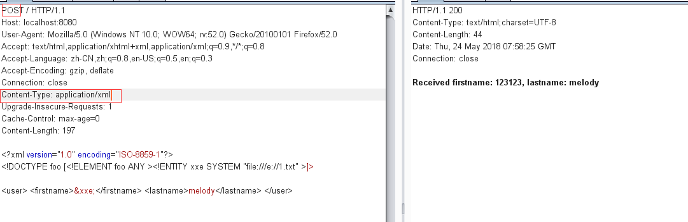

漏洞原因：XMLBeans 提供了底层XML数据的对象视图，同时还能访问原始的XML信息集合。 Spring Data Commons 1.13至1.13.11以及2.0至2.0.6的版本在与XMLBeam1.4.14或更早的版本进行结合使用时，XMLBeam不会限制XML外部实体应用，导致未经身份验证的远程恶意用户可以针对Spring Data的请求绑定特定的参数，访问系统上的任意文件。

[漏洞分析1](https://xz.aliyun.com/t/2341)

[漏洞分析2](https://paper.seebug.org/600/)

注意点：

