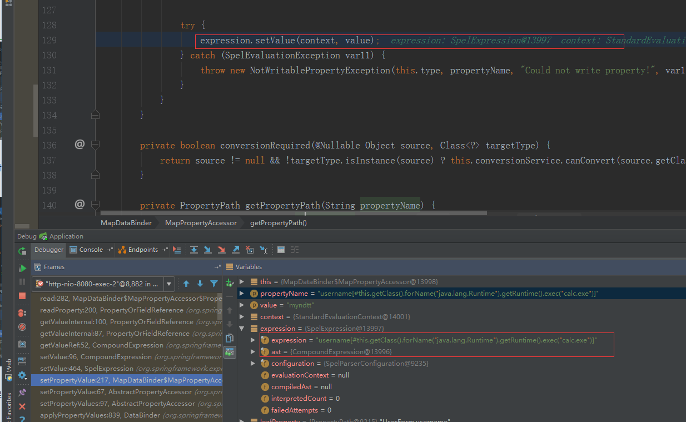
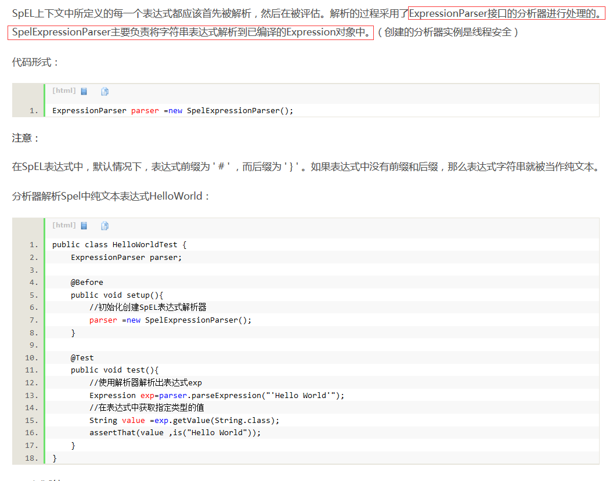

漏洞起因：Spring Data Commons SPEL注入

[漏洞分析](https://xz.aliyun.com/t/2269)

注意点

这也是为什么文中会说下面两句话值得寻找

`expression.getValue(context, Boolean.class)`

`expression.setValue(context, value)`

[拓展链接](https://docs.spring.io/spring/docs/3.0.x/spring-framework-reference/html/expressions.html)

